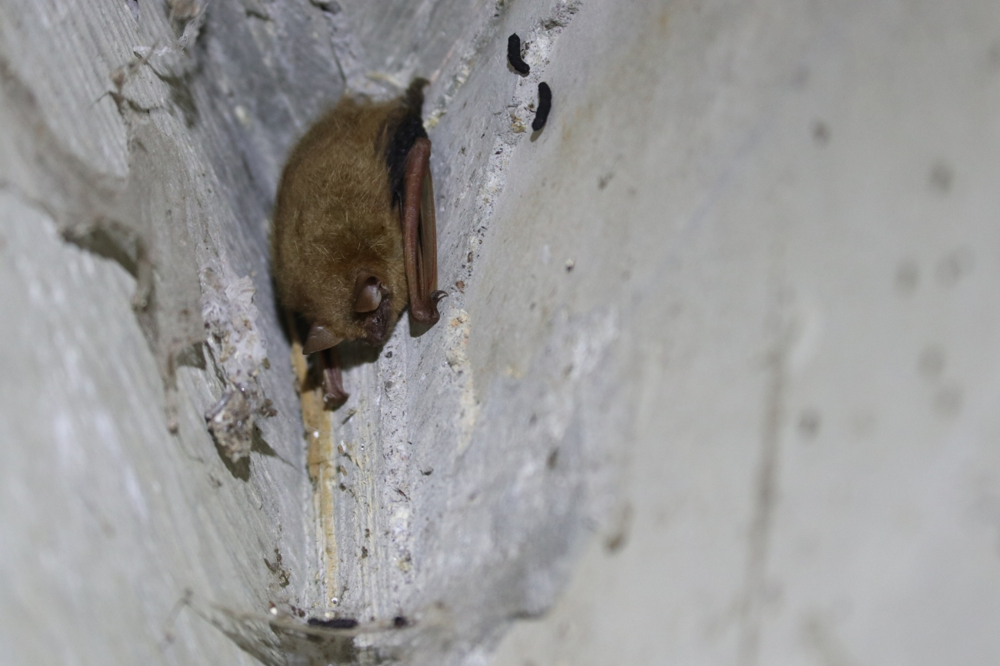

```{r}
#| label: setup
#| include: false

library(tidyverse)
library(lubridate)
library(sf)
library(scales)
library(leaflet)
library(htmlwidgets)
library(htmltools)
library(base64enc)

load("coe-bats.RData")
#save.image("coe-bats.RData")
```

{width="100%"}

## Executive Summary

SENSR (Services for Environmental Sensor Research; [sensr.ca](sensr.ca)), a unit of Biodiversity Pathways ([biodiversitypathways.ca](biodiversitypathways.ca)), helps researchers and organizations obtain greater value from environmental sensor data. For this project, SENSR worked with Dr. Erin Bayne and Dr. Matina Kalcounis-Rueppell from the Department of Biological Sciences at the University of Alberta to compile, process, and report on acoustic bat-monitoring data collected in Edmonton in the summer of 2024. This report summarizes the monitoring effort and provides an overview of bat species detections and patterns of bat activity across the study area.

::: {layout-ncol="2"}
{width="70%" fig-align="center"}

{fig-align="center"}
:::

## Land Acknowledgement

Edmonton, ᐊᒥᐢᑿᒌᐚᐢᑲᐦᐃᑲᐣ Amiskwaciwâskahikan, is located within Treaty 6 Territory and within the Métis homelands and Métis Nation of Alberta Region 4. We acknowledge this land as the traditional territories of many First Nations such as the Nehiyaw (Cree), Denesuliné (Dene), Nakota Sioux (Stoney), Anishinaabe (Saulteaux) and Niitsitapi (Blackfoot).

## Study Overview

Passive acoustic monitoring was used across Edmonton to document bat presence, species composition, and patterns of acoustic activity during the summer of 2024. Recordings collected at sites throughout the city detected several bat species and groups, including both resident and migratory species. Bat activity varied among space and time, potentially reflecting differences in habitat conditions, resource availability, and species behaviour. These recordings provide a baseline dataset for understanding the distribution and activity of bats in Edmonton and can support future monitoring of urban bat communities.

## Introduction

Edmonton supports a network of urban natural areas, including the North Saskatchewan River valley, connected ravines, wetlands, parks, and developed neighbourhoods. The river valley and ravine system extends for more than 100 km and covers over 7,400 ha, forming one of North America’s largest continuous urban park networks (@CityofEdmonton2024). Together, these interconnected habitats provide bats with a range of foraging and roosting opportunities, including both natural features and human-made structures.

Bats are an important component of urban biodiversity and contribute to ecosystem functions such as insect suppression and nutrient cycling (@kunz2011ecosystem). Alberta supports at least nine bat species, and eight are estimated to occur in Edmonton (Bayne, unpublished data). These include resident and short-distance migratory species, such as little brown bat (*Myotis lucifugus*) and big brown bat (*Eptesicus fuscus*), as well as long-distance migrants such as hoary bat (*Lasiurus cinereus*), eastern red bat (*Lasiurus borealis*), and silver-haired bat (*Lasionycteris noctivagans*). Northern long-eared bat (*Myotis septentrionalis*), a forest-associated species not typically linked with highly urbanized landscapes, has also been confirmed within the city (Cory Olson, pers. comm.).

Bats are difficult to monitor through direct observation because they are nocturnal, and highly mobile. Autonomous recording units equipped with ultrasonic microphones provide a non-invasive method for monitoring bats over extended periods. By recording echolocation calls across multiple nights, these units document species presence, compare relative activity among locations, and examine temporal activity patterns. Passive acoustic monitoring is widely used in bat-monitoring programs, including the North American Bat Monitoring Program, which supports standardized and coordinated monitoring across North America (@Loeb2015NABatPlan).

Urban bats may be affected by changes in habitat availability, loss of mature trees and roosting structures, artificial light at night, noise, and other forms of human disturbance. Monitoring bats across Edmonton can therefore provide information on how different species use the city’s connected green spaces and help identify locations that support relatively high levels of activity. In 2024, acoustic recording units were deployed across the City of Edmonton to document bat activity. This report summarizes the processed acoustic data, including the species and species groups detected, activity patterns through the night, and variation among monitoring locations. Although the project was not formally part of the North American Bat Monitoring Program, the study design and reporting approach follow a similar structure and provide a baseline for future bat monitoring in Edmonton.

## Methods

### Field Deployments

```{r}
#| label: helper-functions
#| include: false
#| eval: false

first_text <- function(x) {
  x <- as.character(x)
  x <- x[!is.na(x) & str_trim(x) != ""]
  
  if (length(x) == 0) {
    return(NA_character_)
  }
  
  x[1]
}

first_number <- function(x) {
  x <- x[!is.na(x)]
  
  if (length(x) == 0) {
    return(NA_real_)
  }
  
  as.numeric(x[1])
}

collapse_text <- function(x) {
  x <- as.character(x)
  x <- x[!is.na(x) & str_trim(x) != ""]
  
  if (length(x) == 0) {
    return(NA_character_)
  }
  
  paste(unique(x), collapse = "; ")
}

safe_min_date <- function(x) {
  if (all(is.na(x))) {
    return(as.Date(NA))
  }
  
  min(x, na.rm = TRUE)
}

safe_max_date <- function(x) {
  if (all(is.na(x))) {
    return(as.Date(NA))
  }
  
  max(x, na.rm = TRUE)
}
```

```{r}
#| label: clean-bat-detections and prepare data
#| include: false

metadata <- read.csv(
  "2024-Proof-Lat-Long-CBAT.csv",
  stringsAsFactors = FALSE
)

site_metadata <- metadata %>%
  mutate(
    Location = str_trim(str_remove(Location, "\\?$")),
    LonginR = if_else(LonginR > 0, -LonginR, LonginR),
    VisitDate = dmy(VisitDate, quiet = TRUE)
  ) %>%
  filter(
    !is.na(Location),
    Location != ""
  ) %>%
  group_by(Location) %>%
  summarise(
    BAT = first_text(BAT),
    latitude = first_number(LatinR),
    longitude = first_number(LonginR),
    first_visit_date = safe_min_date(VisitDate),
    last_visit_date = safe_max_date(VisitDate),
    visit_types = collapse_text(VisitType),
    observers = collapse_text(c(Observer1, Observer2)),
    comments = collapse_text(CommentsV),
    .groups = "drop"
  ) %>%
  arrange(Location)

bat_raw <- read.csv(
  "bat_data.csv",
  stringsAsFactors = FALSE
)

bat <- bat_raw %>%
  mutate(
    date_time = ymd_hms(recording_date_time, quiet = TRUE),
    date = as.Date(date_time),
    hour = hour(date_time),
    night = if_else(hour >= 12, date, date - 1),
    location = str_trim(str_remove(as.character(location), "\\?$"))
  ) %>%
  filter(
    !is.na(location),
    location != "",
    !is.na(date_time)
  )

bat_site <- bat %>%
  left_join(
    site_metadata,
    by = c("location" = "Location")
  ) %>%
  mutate(
    species_clean = case_when(
      species_code == "EPTFUS" ~ "Big brown bat",
      species_code == "LASNOC" ~ "Silver-haired bat",
      species_code == "LASCIN" ~ "Hoary bat",
      species_code == "LASBOR" ~ "Eastern red bat",
      species_code == "MYOLUC" ~ "Little brown bat",
      species_code == "MYOVOL" ~ "Long-legged myotis",
      species_code == "MYOSEP" ~ "Northern long-eared bat",
      species_code == "MYOEVO" ~ "Long-eared myotis",
      species_code == "MYOCIL" ~ "Western small-footed myotis",
      
      species_code %in% c(
        "40kMyo",
        "MYOLUCMYOVOL",
        "MYOCILMYOVOL",
        "MYOSEPMYOVOL",
        "MYOEVOMYOVOL"
      ) ~ "Myotis spp.",
      
      species_code %in% c(
        "EPTFUSLASNOC",
        "LASCINLASNOC",
        "LowF"
      ) ~ "Low-frequency bat group",
      
      species_code == "LASBORMYOEVO" ~ "Ambiguous high-frequency bat",
      species_code == "HighF" ~ "High-frequency bat group",
      species_code == "UBAT" ~ "Unidentified bat",
      TRUE ~ "Other / check code"
    ),
    
    species_confidence = case_when(
      species_code %in% c(
        "EPTFUS",
        "LASNOC",
        "LASCIN",
        "LASBOR",
        "MYOLUC",
        "MYOVOL",
        "MYOSEP",
        "MYOEVO",
        "MYOCIL"
      ) ~ "Species-level ID",
      
      species_code == "UBAT" ~ "Unidentified",
      TRUE ~ "Ambiguous group"
    ))

location_summary <- bat_site %>%
  group_by(location) %>%
  summarise(
    detections = n(),
    species_level_detections = sum(species_confidence == "Species-level ID"),
    ambiguous_detections = sum(species_confidence == "Ambiguous group"),
    unidentified_detections = sum(species_confidence == "Unidentified"),
    species_richness = n_distinct(
      species_clean[species_confidence == "Species-level ID"]
    ),
    first_detection = min(date_time, na.rm = TRUE),
    last_detection = max(date_time, na.rm = TRUE),
    nights_with_detections = n_distinct(night),
    detections_per_night = round(n() / n_distinct(night), 1),
    .groups = "drop"
  ) %>%
  arrange(desc(detections))

site_status <- site_metadata %>%
  mutate(
    in_bat_detection_data = Location %in% unique(bat$location),
    site_status = if_else(
      in_bat_detection_data,
      "In processed data",
      "In metadata only"
    )
  )

site_status_sf <- site_status %>%
  filter(
    !is.na(latitude),
    !is.na(longitude)
  ) %>%
  st_as_sf(
    coords = c("longitude", "latitude"),
    crs = 4326,
    remove = FALSE
  )

site_results_sf <- site_status_sf %>%
  left_join(
    location_summary,
    by = c("Location" = "location")
  )

```

In 2024, 35 acoustic recording units were deployed between July 15 and August 26 across the City of Edmonton and surrounding areas. Deployments followed the standards set by NABat and the North by Northwest Bat Hub (@reichert2018guide).

### Data Processing

Full-spectrum recordings from the sampling period were collected and processed using two automatic classifiers: Kaleidoscope’s Bats of U.S. and Canada 5.7.0 classifier and SonoBat’s Southwest Canada–Prairie classifier. Based on documented species ranges and prior detection data, manual verification efforts focused on the species present within the city of Edmonton.

The analysis workflow followed processing standards established by the North American Bat Monitoring Program (NABat) (@reichert2018guide). Only recordings that received automated species classifications from either Kaleidoscope or SonoBat were selected for manual verification. Recordings were manually vetted until at least one recording per species per site per night was confidently identified.

Species identifications were validated using reference call parameters described by Szewczak (@szewczak2022echolocation) and Vesper (@VesperBats2022), in accordance with NABat manual vetting protocols. Species detections were summarized by monitoring location and night. Species codes were grouped into species-level identifications, acoustic groups, and unidentified bat detections. Species-level identifications were used for species richness summaries, while acoustic groups and unidentified detections were retained in summaries of overall bat activity.

All recordings with their associated tags were uploaded to WildTrax under the [Bat Community - City of Edmonton](https://portal.wildtrax.ca/aru/4524) project.

## Results

A total of 35,612 bat detections were recorded across 35 monitoring locations in Edmonton between July 15 and August 26, 2024. Eight species were identified in the processed recordings. Little brown bat was the most frequently identified species, with 5,468 detections, followed by silver-haired bat with 4,683 detections and hoary bat with 4,038 detections. Long-eared myotis was detected least frequently, with 16 detections (@fig-species).

```{r}
#| label: fig-interactive-map
#| fig-cap: "Interactive map of acoustic monitoring locations across Edmonton. Select a site marker to view the number of sampling nights, total bat detections, and species detected at each location."
#| warning: false
#| message: false
#| echo: false


bat_map_data <- bat_site %>%
  mutate(
    table_category = case_when(

      species_confidence == "Species-level ID" ~ species_code,

      species_code %in% c(
        "HighF",
        "LASBORMYOEVO"
      ) ~ "High Frequency",

      species_code %in% c(
        "LowF",
        "EPTFUSLASNOC",
        "LASCINLASNOC"
      ) ~ "Low Frequency",

      species_code %in% c(
        "40kMyo",
        "MYOLUCMYOVOL",
        "MYOCILMYOVOL",
        "MYOSEPMYOVOL",
        "MYOEVOMYOVOL"
      ) ~ "40K MYO",

      species_code == "UBAT" ~ "NoID",

      TRUE ~ species_code
    )
  )

muted_species_palette <- c(
  "Big brown bat" = "#8C6D62",
  "Silver-haired bat" = "#708A8A",
  "Hoary bat" = "#A48B78",
  "Eastern red bat" = "#B56F69",

  "Little brown bat" = "#7A8062",
  "Little brown myotis" = "#7A8062",

  "Long-legged myotis" = "#7187A6",

  "Northern long-eared bat" = "#9A7B92",
  "Northern long-eared myotis" = "#9A7B92",

  "Long-eared bat" = "#B29A68",
  "Long-eared myotis" = "#B29A68",

  "Western small-footed myotis" = "#77947D"
)

plot_to_base64 <- function(
    plot,
    width = 720,
    height = 430,
    res = 110
) {

  temporary_file <- tempfile(fileext = ".png")

  png(
    filename = temporary_file,
    width = width,
    height = height,
    res = res
  )

  print(plot)
  dev.off()

  encoded_image <- base64enc::dataURI(
    file = temporary_file,
    mime = "image/png"
  )

  unlink(temporary_file)

  paste0(
    ""
  )
}

create_site_popup <- function(site_code) {

  site_data <- bat_map_data %>%
    filter(location == site_code)

  site_information <- site_results_sf %>%
    st_drop_geometry() %>%
    filter(Location == site_code) %>%
    slice(1)

  popup_id <- str_replace_all(
    site_code,
    "[^A-Za-z0-9]",
    ""
  )

  species_table <- site_data %>%
    count(
      table_category,
      name = "detections"
    )

  group_categories <- c(
    "High Frequency",
    "Low Frequency",
    "40K MYO",
    "NoID"
  )

  species_categories <- species_table %>%
    filter(!table_category %in% group_categories) %>%
    arrange(table_category)

  acoustic_groups <- species_table %>%
    filter(table_category %in% group_categories) %>%
    mutate(
      table_category = factor(
        table_category,
        levels = group_categories
      )
    ) %>%
    arrange(table_category) %>%
    mutate(
      table_category = as.character(table_category)
    )

  species_table <- bind_rows(
    species_categories,
    acoustic_groups
  )

  total_bats <- nrow(site_data)

  species_table <- bind_rows(
    species_table,
    tibble(
      table_category = "Total bats",
      detections = total_bats
    )
  )

  table_rows <- paste0(
    "<tr>",
    "<td>",
    htmlEscape(species_table$table_category),
    "</td>",
    "<td class='number-cell'>",
    comma(species_table$detections),
    "</td>",
    "</tr>",
    collapse = ""
  )

  table_html <- paste0(
    "<table class='species-table'>",
    "<thead>",
    "<tr>",
    "<th>Species code</th>",
    "<th class='number-cell'>Detections</th>",
    "</tr>",
    "</thead>",
    "<tbody>",
    table_rows,
    "</tbody>",
    "</table>"
  )

  site_time <- site_data %>%
    count(
      night,
      name = "detections"
    ) %>%
    complete(
      night = seq(
        min(night, na.rm = TRUE),
        max(night, na.rm = TRUE),
        by = "day"
      ),
      fill = list(detections = 0)
    )

  time_plot <- ggplot(
    site_time,
    aes(
      x = night,
      y = detections
    )
  ) +
    geom_col() +
    scale_y_continuous(
      labels = comma,
      expand = expansion(
        mult = c(0, 0.08)
      )
    ) +
    labs(
      x = "Night",
      y = "Number of detections"
    ) +
    theme_bw(base_size = 11) +
    theme(
      panel.grid.minor = element_blank(),
      axis.text.x = element_text(
        angle = 45,
        hjust = 1
      )
    )

  time_plot_html <- plot_to_base64(
    time_plot,
    width = 720,
    height = 430
  )

  species_composition <- site_data %>%
    filter(
      species_confidence == "Species-level ID"
    ) %>%
    count(
      species_clean,
      name = "detections"
    ) %>%
    mutate(
      percent = round(detections / sum(detections) * 100, 1),
      legend_label = paste0(species_clean, " (", percent, "%)")
    ) %>%
    arrange(desc(detections))

  if (nrow(species_composition) > 0) {

    pie_colors_site <- muted_species_palette[species_composition$species_clean]
    names(pie_colors_site) <- species_composition$legend_label

    pie_plot <- ggplot(
      species_composition,
      aes(
        x = "",
        y = detections,
        fill = legend_label
      )
    ) +
      geom_col(
        width = 1,
        color = "white",
        linewidth = 0.25
      ) +
      coord_polar(theta = "y") +
      scale_fill_manual(
        values = pie_colors_site
      ) +
      labs(
        fill = "Species"
      ) +
      theme_void(base_size = 11) +
      theme(
        legend.position = "right",
        legend.title = element_text(
          face = "bold"
        ),
        legend.text = element_text(
          size = 9
        )
      )

    pie_plot_html <- plot_to_base64(
      pie_plot,
      width = 780,
      height = 470
    )

  } else {

    pie_plot_html <- paste0(
      "<p>No species-level detections were available ",
      "for this monitoring location.</p>"
    )
  }

  site_name_html <- if (
    is.na(site_information$BAT) ||
    site_information$BAT == ""
  ) {

    ""

  } else {

    paste0(
      "<div class='site-name'>",
      htmlEscape(site_information$BAT),
      "</div>"
    )
  }

  paste0(
    "<div class='site-popup'>",

    "<h3>",
    htmlEscape(site_code),
    "</h3>",

    site_name_html,

    "<div class='tab-buttons'>",

    "<button class='tab-button active' ",
    "onclick=\"openBatTab(event, 'table-",
    popup_id,
    "')\">",
    "Species table",
    "</button>",

    "<button class='tab-button' ",
    "onclick=\"openBatTab(event, 'time-",
    popup_id,
    "')\">",
    "Detections over time",
    "</button>",

    "<button class='tab-button' ",
    "onclick=\"openBatTab(event, 'pie-",
    popup_id,
    "')\">",
    "Species composition",
    "</button>",

    "</div>",

    "<div id='table-",
    popup_id,
    "' class='bat-tab-content' style='display:block;'>",
    table_html,
    "</div>",

    "<div id='time-",
    popup_id,
    "' class='bat-tab-content'>",
    time_plot_html,
    "</div>",

    "<div id='pie-",
    popup_id,
    "' class='bat-tab-content'>",
    pie_plot_html,
    "</div>",

    "</div>"
  )
}

map_sites <- site_results_sf %>%
  filter(!is.na(detections)) %>%
  mutate(
    activity_class = case_when(
      detections <= 250 ~ "≤ 250",
      detections <= 500 ~ "251–500",
      detections <= 1000 ~ "501–1,000",
      detections <= 2000 ~ "1,001–2,000",
      TRUE ~ "> 2,000"
    ),

    marker_radius = case_when(
      activity_class == "≤ 250" ~ 4,
      activity_class == "251–500" ~ 6,
      activity_class == "501–1,000" ~ 8,
      activity_class == "1,001–2,000" ~ 10,
      activity_class == "> 2,000" ~ 12
    )
  )

map_sites$popup_html <- map_chr(
  map_sites$Location,
  create_site_popup
)

richness_pal <- colorNumeric(
  palette = "YlGnBu",
  domain = map_sites$species_richness,
  na.color = "gray70"
)

size_legend_html <- "
<div class='map-size-legend'>

  <b>Activity</b><br>
  <span>Total detections</span>

  <div class='size-row'>
    <span class='circle c4'></span>
    <span>≤ 250</span>
  </div>

  <div class='size-row'>
    <span class='circle c6'></span>
    <span>251–500</span>
  </div>

  <div class='size-row'>
    <span class='circle c8'></span>
    <span>501–1,000</span>
  </div>

  <div class='size-row'>
    <span class='circle c10'></span>
    <span>1,001–2,000</span>
  </div>

  <div class='size-row'>
    <span class='circle c12'></span>
    <span>&gt; 2,000</span>
  </div>

</div>
"

popup_css <- "
.site-popup {
  width: 600px;
  max-width: 100%;
  font-family: Arial, sans-serif;
}

.site-popup h3 {
  margin: 0 0 3px 0;
  font-size: 18px;
}

.site-name {
  color: #555;
  margin-bottom: 12px;
}

.tab-buttons {
  display: flex;
  border-bottom: 1px solid #ccc;
  margin-bottom: 12px;
}

.tab-button {
  background: #f3f3f3;
  border: none;
  padding: 9px 12px;
  cursor: pointer;
  font-size: 12px;
}

.tab-button:hover {
  background: #e3e3e3;
}

.tab-button.active {
  background: #555;
  color: white;
}

.bat-tab-content {
  display: none;
  max-height: 430px;
  overflow-y: auto;
}

.species-table {
  width: 100%;
  border-collapse: collapse;
}

.species-table th,
.species-table td {
  padding: 7px 9px;
  border-bottom: 1px solid #ddd;
}

.species-table th {
  background: #f3f3f3;
  text-align: left;
}

.species-table .number-cell {
  text-align: right;
}

.species-table tbody tr:last-child {
  font-weight: bold;
  border-top: 2px solid #777;
}

.map-size-legend {
  background: white;
  padding: 10px 12px;
  border: 1px solid #bbb;
  border-radius: 4px;
  line-height: 1.2;
}

.map-size-legend > span {
  font-size: 11px;
}

.size-row {
  display: flex;
  align-items: center;
  height: 31px;
  gap: 10px;
}

.circle {
  display: inline-block;
  border-radius: 50%;
  background: #999;
  border: 1px solid #333;
  flex-shrink: 0;
}

.c4 {
  width: 8px;
  height: 8px;
  margin-left: 8px;
}

.c6 {
  width: 12px;
  height: 12px;
  margin-left: 6px;
}

.c8 {
  width: 16px;
  height: 16px;
  margin-left: 4px;
}

.c10 {
  width: 20px;
  height: 20px;
  margin-left: 2px;
}

.c12 {
  width: 24px;
  height: 24px;
}
"

tab_javascript <- "
window.openBatTab = function(evt, tabId) {

  var popup = evt.target.closest('.site-popup');

  var contents =
    popup.getElementsByClassName('bat-tab-content');

  var buttons =
    popup.getElementsByClassName('tab-button');

  for (var i = 0; i < contents.length; i++) {
    contents[i].style.display = 'none';
  }

  for (var j = 0; j < buttons.length; j++) {
    buttons[j].classList.remove('active');
  }

  popup.querySelector('#' + tabId).style.display = 'block';
  evt.currentTarget.classList.add('active');
};
"

site_popups <- lapply(
  map_sites$popup_html,
  htmltools::HTML
)

bat_map <- leaflet(
  map_sites,
  width = "100%",
  height = 650,
  options = leafletOptions(
    minZoom = 9,
    maxZoom = 13
  )
) %>%

  addProviderTiles(
    providers$CartoDB.Positron,
    options = providerTileOptions(
      noWrap = TRUE
    )
  ) %>%

  addCircleMarkers(
    radius = ~marker_radius,
    color = "black",  
    fillColor = ~richness_pal(species_richness),
    stroke = TRUE,
    weight = 1,
    fillOpacity = 0.85,

    popup = site_popups,

    popupOptions = popupOptions(
      maxWidth = 650,
      minWidth = 520,
      maxHeight = 600,
      autoPan = TRUE
    )
  ) %>%

  addLegend(
    position = "bottomright",
    pal = richness_pal,
    values = ~species_richness,
    title = "Species richness",
    opacity = 0.85
  ) %>%

  addControl(
    html = HTML(size_legend_html),
    position = "bottomleft"
  ) %>%

  htmlwidgets::prependContent(
    tags$style(
      HTML(popup_css)
    ),
    tags$script(
      HTML(tab_javascript)
    )
  )

bat_map
```

```{r}
#| label: fig-species
#| fig-cap: "Number of processed bat detections by species or acoustic identification group. Bars represent the total number of detections."
#| fig-width: 8
#| fig-height: 5
#| code-summary: "Show species plot code"
#| echo: false

species_summary <- bat_site %>%
  count(
    species_clean,
    species_confidence,
    name = "n",
    sort = TRUE
  )

p_species <- species_summary %>%
  ggplot(
    aes(
      x = fct_reorder(species_clean, n),
      y = n
    )
  ) +
  geom_col() +
  coord_flip() +
  scale_y_continuous(labels = comma) +
  labs(
    x = NULL,
    y = "Number of detections"
  ) +
  theme_bw()

p_species
```

Migratory species, including silver-haired, hoary, and eastern red bats, accounted for 56.6% of species-level detections, while non-migratory species accounted for 43.4%. Silver-haired bat was the most frequently detected migratory species, while little brown bat was the most frequently detected non-migratory species.

Bat activity varied among monitoring locations. CBAT-CAL-1B had the highest total activity, with 6,094 detections across 10 nights, equivalent to approximately 609 detections per night. CBAT-SHA-1B had the second-highest total, with 4,455 detections across 22 nights. CBAT-QUA-1B and CBAT-HAM-1B also had relatively high activity, averaging approximately 356 and 309 detections per night, respectively (@fig-sites). Eight species were identified at CBAT-CAL-1B, CBAT-EST-1B, CBAT-KUC-1B, CBAT-SIL-1B, and CBAT-VIR-1B.

```{r}
#| label: fig-sites
#| fig-cap: "Nightly variation in bat detections among the 15 monitoring sites with the highest overall activity. Boxes summarize the distribution across nights, while points represent individual nights."
#| fig-width: 8
#| fig-height: 6
#| code-summary: "Show site boxplot code"
#| echo: false

top_locations_boxplot <- location_summary %>%
  slice_max(
    order_by = detections,
    n = 15,
    with_ties = FALSE
  ) %>%
  pull(location)

site_nightly <- bat_site %>%
  filter(location %in% top_locations_boxplot) %>%
  count(
    location,
    night,
    name = "detections"
  )

p_sites <- site_nightly %>%
  ggplot(
    aes(
      x = fct_reorder(location, detections, .fun = median),
      y = detections
    )
  ) +
  geom_boxplot(
    outlier.shape = NA,
    width = 0.7
  ) +
  geom_jitter(
    width = 0.15,
    height = 0,
    alpha = 0.4,
    size = 1
  ) +
  coord_flip() +
  scale_y_continuous(labels = comma) +
  labs(
    x = NULL,
    y = "Detections per night"
  ) +
  theme_bw()

p_sites
```

Species differed in their activity patterns through the night. Little brown bat and big brown bat showed pronounced peaks at approximately 22:00. Eastern red bat activity was highest between 22:00 and midnight, whereas hoary bat activity peaked later, at approximately 02:00. Silver-haired bat activity remained relatively high from midnight until approximately 04:00. Activity patterns for less frequently detected species were more variable because of the smaller number of detections (@fig-nightspecies).

```{r}
#| label: fig-nightspecies 
#| fig-cap: "Mean hourly bat activity by species between 20:00 and 06:00. Values represent the average number of detections per site-night."
#| fig-width: 10
#| fig-height: 7
#| code-summary: "Show hourly activity code" 
#| echo: false

night_hour_key <- tibble( hour = c(20:23, 0:6), hour_plot = 20:30, hour_label = c( "20:00", "21:00", "22:00", "23:00", "00:00", "01:00", "02:00", "03:00", "04:00", "05:00", "06:00" ) )

sampled_site_nights <- bat_site %>% distinct(location, night)

species_hour_grid <- crossing( species_clean = bat_site %>% filter(species_confidence == "Species-level ID") %>% distinct(species_clean) %>% pull(species_clean), hour = night_hour_key$hour, sampled_site_nights )

hourly_species <- bat_site %>% filter( species_confidence == "Species-level ID", hour %in% night_hour_key$hour ) %>% count( location, night, species_clean, hour, name = "n" ) %>% right_join( species_hour_grid, by = c("location", "night", "species_clean", "hour") ) %>% mutate( n = replace_na(n, 0L) ) %>% group_by(species_clean, hour) %>% summarise( mean_detections = mean(n), .groups = "drop" ) %>% left_join( night_hour_key, by = "hour" ) %>% arrange( species_clean, hour_plot )

p_hourly_species <- ggplot( hourly_species, aes( x = hour_plot, y = mean_detections ) ) + geom_line(linewidth = 0.8) + geom_point(size = 1.8) + facet_wrap( ~species_clean, scales = "free_y" ) + scale_x_continuous( breaks = night_hour_key$hour_plot,
                                                                                                                                                                                                                      labels = night_hour_key$hour_label ) + scale_y_continuous(labels = comma) + labs( x = "Hour of night", y = "Mean detections per site-night" ) + theme_bw() + theme( panel.grid.minor = element_blank(), axis.text.x = element_text(angle = 45, hjust = 1) )

p_hourly_species 
```

## Concluding Remarks

The 2024 City of Edmonton bat acoustic dataset provides a city-wide summary of bat activity across monitored locations. Multiple bat species were detected across the city, with variation in activity among locations and throughout the night. Because these results are based on processed acoustic detection records, they should be interpreted as measures of relative acoustic activity rather than direct estimates of abundance, population size, or site occupancy. Detection totals may also reflect differences in sampling effort, environmental conditions, and species-specific detectability. Overall, this dataset provides a useful baseline for future bat monitoring in Edmonton.
