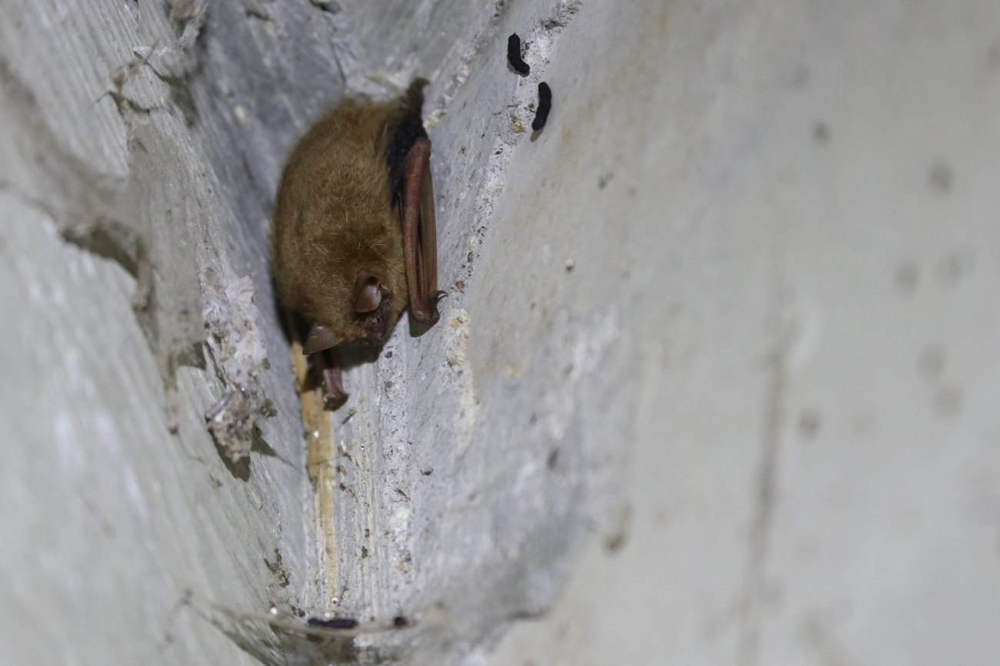

```{r}
#| label: setup
#| include: false

library(tidyverse)
library(lubridate)
library(sf)
library(scales)
library(leaflet)
library(htmlwidgets)
library(htmltools)
library(base64enc)

load("coe-bats.RData")
#save.image("coe-bats.RData")
```

{width="100%"}

## Executive Summary


::: {layout-ncol="2"}
{width="70%" fig-align="center"}

{fig-align="center"}
:::

## Land Acknowledgement

Edmonton, ᐊᒥᐢᑿᒌᐚᐢᑲᐦᐃᑲᐣ Amiskwaciwâskahikan, is located within Treaty 6 Territory and within the Métis homelands and Métis Nation of Alberta Region 4. We acknowledge this land as the traditional territories of many First Nations such as the Nehiyaw (Cree), Denesuliné (Dene), Nakota Sioux (Stoney), Anishinaabe (Saulteaux) and Niitsitapi (Blackfoot).

## Bats in Alberta and Edmonton


## How Did We Do It?

### Field Deployments

```{r}
#| label: helper-functions
#| include: false
#| eval: false

first_text <- function(x) {
  x <- as.character(x)
  x <- x[!is.na(x) & str_trim(x) != ""]
  
  if (length(x) == 0) {
    return(NA_character_)
  }
  
  x[1]
}

first_number <- function(x) {
  x <- x[!is.na(x)]
  
  if (length(x) == 0) {
    return(NA_real_)
  }
  
  as.numeric(x[1])
}

collapse_text <- function(x) {
  x <- as.character(x)
  x <- x[!is.na(x) & str_trim(x) != ""]
  
  if (length(x) == 0) {
    return(NA_character_)
  }
  
  paste(unique(x), collapse = "; ")
}

safe_min_date <- function(x) {
  if (all(is.na(x))) {
    return(as.Date(NA))
  }
  
  min(x, na.rm = TRUE)
}

safe_max_date <- function(x) {
  if (all(is.na(x))) {
    return(as.Date(NA))
  }
  
  max(x, na.rm = TRUE)
}
```

```{r}
#| label: clean-bat-detections and prepare data
#| include: false

metadata <- read.csv(
  "2024-Proof-Lat-Long-CBAT.csv",
  stringsAsFactors = FALSE
)

site_metadata <- metadata %>%
  mutate(
    Location = str_trim(str_remove(Location, "\\?$")),
    LonginR = if_else(LonginR > 0, -LonginR, LonginR),
    VisitDate = dmy(VisitDate, quiet = TRUE)
  ) %>%
  filter(
    !is.na(Location),
    Location != ""
  ) %>%
  group_by(Location) %>%
  summarise(
    BAT = first_text(BAT),
    latitude = first_number(LatinR),
    longitude = first_number(LonginR),
    first_visit_date = safe_min_date(VisitDate),
    last_visit_date = safe_max_date(VisitDate),
    visit_types = collapse_text(VisitType),
    observers = collapse_text(c(Observer1, Observer2)),
    comments = collapse_text(CommentsV),
    .groups = "drop"
  ) %>%
  arrange(Location)

bat_raw <- read.csv(
  "bat_data.csv",
  stringsAsFactors = FALSE
)

bat <- bat_raw %>%
  mutate(
    date_time = ymd_hms(recording_date_time, quiet = TRUE),
    date = as.Date(date_time),
    hour = hour(date_time),
    night = if_else(hour >= 12, date, date - 1),
    location = str_trim(str_remove(as.character(location), "\\?$"))
  ) %>%
  filter(
    !is.na(location),
    location != "",
    !is.na(date_time)
  )

bat_site <- bat %>%
  left_join(
    site_metadata,
    by = c("location" = "Location")
  ) %>%
  mutate(
    species_clean = case_when(
      species_code == "EPTFUS" ~ "Big brown bat",
      species_code == "LASNOC" ~ "Silver-haired bat",
      species_code == "LASCIN" ~ "Hoary bat",
      species_code == "LASBOR" ~ "Eastern red bat",
      species_code == "MYOLUC" ~ "Little brown bat",
      species_code == "MYOVOL" ~ "Long-legged myotis",
      species_code == "MYOSEP" ~ "Northern long-eared bat",
      species_code == "MYOEVO" ~ "Long-eared myotis",
      species_code == "MYOCIL" ~ "Western small-footed myotis",
      
      species_code %in% c(
        "40kMyo",
        "MYOLUCMYOVOL",
        "MYOCILMYOVOL",
        "MYOSEPMYOVOL",
        "MYOEVOMYOVOL"
      ) ~ "Myotis spp.",
      
      species_code %in% c(
        "EPTFUSLASNOC",
        "LASCINLASNOC",
        "LowF"
      ) ~ "Low-frequency bat group",
      
      species_code == "LASBORMYOEVO" ~ "Ambiguous high-frequency bat",
      species_code == "HighF" ~ "High-frequency bat group",
      species_code == "UBAT" ~ "Unidentified bat",
      TRUE ~ "Other / check code"
    ),
    
    species_confidence = case_when(
      species_code %in% c(
        "EPTFUS",
        "LASNOC",
        "LASCIN",
        "LASBOR",
        "MYOLUC",
        "MYOVOL",
        "MYOSEP",
        "MYOEVO",
        "MYOCIL"
      ) ~ "Species-level ID",
      
      species_code == "UBAT" ~ "Unidentified",
      TRUE ~ "Ambiguous group"
    ))

location_summary <- bat_site %>%
  group_by(location) %>%
  summarise(
    detections = n(),
    species_level_detections = sum(species_confidence == "Species-level ID"),
    ambiguous_detections = sum(species_confidence == "Ambiguous group"),
    unidentified_detections = sum(species_confidence == "Unidentified"),
    species_richness = n_distinct(
      species_clean[species_confidence == "Species-level ID"]
    ),
    first_detection = min(date_time, na.rm = TRUE),
    last_detection = max(date_time, na.rm = TRUE),
    nights_with_detections = n_distinct(night),
    detections_per_night = round(n() / n_distinct(night), 1),
    .groups = "drop"
  ) %>%
  arrange(desc(detections))

site_status <- site_metadata %>%
  mutate(
    in_bat_detection_data = Location %in% unique(bat$location),
    site_status = if_else(
      in_bat_detection_data,
      "In processed data",
      "In metadata only"
    )
  )

site_status_sf <- site_status %>%
  filter(
    !is.na(latitude),
    !is.na(longitude)
  ) %>%
  st_as_sf(
    coords = c("longitude", "latitude"),
    crs = 4326,
    remove = FALSE
  )

site_results_sf <- site_status_sf %>%
  left_join(
    location_summary,
    by = c("Location" = "location")
  )

site_results_sf <- site_results_sf |> 
  mutate(detections = detections * 10)

```

We placed 34 acoustic recording units across Edmonton and surrounding areas between July 15 and August 26. These recorders captured the high-frequency sounds bats use to navigate and find food. Monitoring followed guidelines from the North American Bat Monitoring Program (NABat) and the North by Northwest Bat Hub (@reichert2018guide).

##Data Processing 

The recordings were first analyzed using two computer programs, Kaleidoscope and SonoBat, which automatically identify bat calls based on their acoustic characteristics. These programs helped narrow down recordings most likely to contain calls from different bat species. We then reviewed recordings identified by either program manually. Because some bat species have very similar calls, this additional step is important for confirming species identifications. 

For each monitoring site and night, we reviewed recordings until we could confidently identify at least one call from each detected species. Species identifications were checked using published reference information on bat calls (@szewczak2022echolocation; @VesperBats2022) and followed NABat review guidelines. 

All recordings and their associated identifications are stored in the [Bat Community - City of Edmonton](https://portal.wildtrax.ca/aru/4524)  project.


## What Did We Find?

A total of 35,612 bat detections were recorded across 35 monitoring locations in Edmonton between July 15 and August 26, 2024. Eight species were identified in the processed recordings. Little brown bat was the most frequently identified species, with 5,468 detections, followed by silver-haired bat with 4,683 detections and hoary bat with 4,038 detections. Long-eared myotis was detected least frequently, with 16 detections (@fig-species).

```{r}
#| label: fig-interactive-map
#| fig-cap: "Interactive map of acoustic monitoring locations across Edmonton. Select a site marker to view the number of sampling nights, total bat detections, and species detected at each location."
#| warning: false
#| message: false
#| echo: false


bat_map_data <- bat_site %>%
  mutate(
    table_category = case_when(

      species_confidence == "Species-level ID" ~ species_code,

      species_code %in% c(
        "HighF",
        "LASBORMYOEVO"
      ) ~ "High Frequency",

      species_code %in% c(
        "LowF",
        "EPTFUSLASNOC",
        "LASCINLASNOC"
      ) ~ "Low Frequency",

      species_code %in% c(
        "40kMyo",
        "MYOLUCMYOVOL",
        "MYOCILMYOVOL",
        "MYOSEPMYOVOL",
        "MYOEVOMYOVOL"
      ) ~ "40K MYO",

      species_code == "UBAT" ~ "NoID",

      TRUE ~ species_code
    )
  )

muted_species_palette <- c(
  "Big brown bat" = "#8C6D62",
  "Silver-haired bat" = "#708A8A",
  "Hoary bat" = "#A48B78",
  "Eastern red bat" = "#B56F69",

  "Little brown bat" = "#7A8062",
  "Little brown myotis" = "#7A8062",

  "Long-legged myotis" = "#7187A6",

  "Northern long-eared bat" = "#9A7B92",
  "Northern long-eared myotis" = "#9A7B92",

  "Long-eared bat" = "#B29A68",
  "Long-eared myotis" = "#B29A68",

  "Western small-footed myotis" = "#77947D"
)

plot_to_base64 <- function(
    plot,
    width = 720,
    height = 430,
    res = 110
) {

  temporary_file <- tempfile(fileext = ".png")

  png(
    filename = temporary_file,
    width = width,
    height = height,
    res = res
  )

  print(plot)
  dev.off()

  encoded_image <- base64enc::dataURI(
    file = temporary_file,
    mime = "image/png"
  )

  unlink(temporary_file)

  paste0(
    ""
  )
}

create_site_popup <- function(site_code) {

  site_data <- bat_map_data %>%
    filter(location == site_code)

  site_information <- site_results_sf %>%
    st_drop_geometry() %>%
    filter(Location == site_code) %>%
    slice(1)

  popup_id <- str_replace_all(
    site_code,
    "[^A-Za-z0-9]",
    ""
  )

  species_table <- site_data %>%
    count(
      table_category,
      name = "detections"
    )

  group_categories <- c(
    "High Frequency",
    "Low Frequency",
    "40K MYO",
    "NoID"
  )

  species_categories <- species_table %>%
    filter(!table_category %in% group_categories) %>%
    arrange(table_category)

  acoustic_groups <- species_table %>%
    filter(table_category %in% group_categories) %>%
    mutate(
      table_category = factor(
        table_category,
        levels = group_categories
      )
    ) %>%
    arrange(table_category) %>%
    mutate(
      table_category = as.character(table_category)
    )

  species_table <- bind_rows(
    species_categories,
    acoustic_groups
  )

  total_bats <- nrow(site_data)

  species_table <- bind_rows(
    species_table,
    tibble(
      table_category = "Total bats",
      detections = total_bats
    )
  )

  table_rows <- paste0(
    "<tr>",
    "<td>",
    htmlEscape(species_table$table_category),
    "</td>",
    "<td class='number-cell'>",
    comma(species_table$detections),
    "</td>",
    "</tr>",
    collapse = ""
  )

  table_html <- paste0(
    "<table class='species-table'>",
    "<thead>",
    "<tr>",
    "<th>Species code</th>",
    "<th class='number-cell'>Detections</th>",
    "</tr>",
    "</thead>",
    "<tbody>",
    table_rows,
    "</tbody>",
    "</table>"
  )

  site_time <- site_data %>%
    count(
      night,
      name = "detections"
    ) %>%
    complete(
      night = seq(
        min(night, na.rm = TRUE),
        max(night, na.rm = TRUE),
        by = "day"
      ),
      fill = list(detections = 0)
    )

  time_plot <- ggplot(
    site_time,
    aes(
      x = night,
      y = detections
    )
  ) +
    geom_col() +
    scale_y_continuous(
      labels = comma,
      expand = expansion(
        mult = c(0, 0.08)
      )
    ) +
    labs(
      x = "Night",
      y = "Number of detections"
    ) +
    theme_bw(base_size = 11) +
    theme(
      panel.grid.minor = element_blank(),
      axis.text.x = element_text(
        angle = 45,
        hjust = 1
      )
    )

  time_plot_html <- plot_to_base64(
    time_plot,
    width = 720,
    height = 430
  )

  species_composition <- site_data %>%
    filter(
      species_confidence == "Species-level ID"
    ) %>%
    count(
      species_clean,
      name = "detections"
    ) %>%
    mutate(
      percent = round(detections / sum(detections) * 100, 1),
      legend_label = paste0(species_clean, " (", percent, "%)")
    ) %>%
    arrange(desc(detections))

  if (nrow(species_composition) > 0) {

    pie_colors_site <- muted_species_palette[species_composition$species_clean]
    names(pie_colors_site) <- species_composition$legend_label

    pie_plot <- ggplot(
      species_composition,
      aes(
        x = "",
        y = detections,
        fill = legend_label
      )
    ) +
      geom_col(
        width = 1,
        color = "white",
        linewidth = 0.25
      ) +
      coord_polar(theta = "y") +
      scale_fill_manual(
        values = pie_colors_site
      ) +
      labs(
        fill = "Species"
      ) +
      theme_void(base_size = 11) +
      theme(
        legend.position = "right",
        legend.title = element_text(
          face = "bold"
        ),
        legend.text = element_text(
          size = 9
        )
      )

    pie_plot_html <- plot_to_base64(
      pie_plot,
      width = 780,
      height = 470
    )

  } else {

    pie_plot_html <- paste0(
      "<p>No species-level detections were available ",
      "for this monitoring location.</p>"
    )
  }

  site_name_html <- if (
    is.na(site_information$BAT) ||
    site_information$BAT == ""
  ) {

    ""

  } else {

    paste0(
      "<div class='site-name'>",
      htmlEscape(site_information$BAT),
      "</div>"
    )
  }

  paste0(
    "<div class='site-popup'>",

    "<h3>",
    htmlEscape(site_code),
    "</h3>",

    site_name_html,

    "<div class='tab-buttons'>",

    "<button class='tab-button active' ",
    "onclick=\"openBatTab(event, 'table-",
    popup_id,
    "')\">",
    "Species table",
    "</button>",

    "<button class='tab-button' ",
    "onclick=\"openBatTab(event, 'time-",
    popup_id,
    "')\">",
    "Detections over time",
    "</button>",

    "<button class='tab-button' ",
    "onclick=\"openBatTab(event, 'pie-",
    popup_id,
    "')\">",
    "Species composition",
    "</button>",

    "</div>",

    "<div id='table-",
    popup_id,
    "' class='bat-tab-content' style='display:block;'>",
    table_html,
    "</div>",

    "<div id='time-",
    popup_id,
    "' class='bat-tab-content'>",
    time_plot_html,
    "</div>",

    "<div id='pie-",
    popup_id,
    "' class='bat-tab-content'>",
    pie_plot_html,
    "</div>",

    "</div>"
  )
}

map_sites <- site_results_sf %>%
  filter(!is.na(detections)) %>%
  mutate(
    activity_class = case_when(
      detections <= 250 ~ "≤ 250",
      detections <= 500 ~ "251–500",
      detections <= 1000 ~ "501–1,000",
      detections <= 2000 ~ "1,001–2,000",
      TRUE ~ "> 2,000"
    ),

    marker_radius = case_when(
      activity_class == "≤ 250" ~ 4,
      activity_class == "251–500" ~ 6,
      activity_class == "501–1,000" ~ 8,
      activity_class == "1,001–2,000" ~ 10,
      activity_class == "> 2,000" ~ 12
    )
  )

map_sites$popup_html <- map_chr(
  map_sites$Location,
  create_site_popup
)

richness_pal <- colorNumeric(
  palette = "YlGnBu",
  domain = map_sites$species_richness,
  na.color = "gray70"
)

size_legend_html <- "
<div class='map-size-legend'>

  <b>Activity</b><br>
  <span>Total detections</span>

  <div class='size-row'>
    <span class='circle c4'></span>
    <span>≤ 250</span>
  </div>

  <div class='size-row'>
    <span class='circle c6'></span>
    <span>251–500</span>
  </div>

  <div class='size-row'>
    <span class='circle c8'></span>
    <span>501–1,000</span>
  </div>

  <div class='size-row'>
    <span class='circle c10'></span>
    <span>1,001–2,000</span>
  </div>

  <div class='size-row'>
    <span class='circle c12'></span>
    <span>&gt; 2,000</span>
  </div>

</div>
"

popup_css <- "
.site-popup {
  width: 600px;
  max-width: 100%;
  font-family: Arial, sans-serif;
}

.site-popup h3 {
  margin: 0 0 3px 0;
  font-size: 18px;
}

.site-name {
  color: #555;
  margin-bottom: 12px;
}

.tab-buttons {
  display: flex;
  border-bottom: 1px solid #ccc;
  margin-bottom: 12px;
}

.tab-button {
  background: #f3f3f3;
  border: none;
  padding: 9px 12px;
  cursor: pointer;
  font-size: 12px;
}

.tab-button:hover {
  background: #e3e3e3;
}

.tab-button.active {
  background: #555;
  color: white;
}

.bat-tab-content {
  display: none;
  max-height: 430px;
  overflow-y: auto;
}

.species-table {
  width: 100%;
  border-collapse: collapse;
}

.species-table th,
.species-table td {
  padding: 7px 9px;
  border-bottom: 1px solid #ddd;
}

.species-table th {
  background: #f3f3f3;
  text-align: left;
}

.species-table .number-cell {
  text-align: right;
}

.species-table tbody tr:last-child {
  font-weight: bold;
  border-top: 2px solid #777;
}

.map-size-legend {
  background: white;
  padding: 10px 12px;
  border: 1px solid #bbb;
  border-radius: 4px;
  line-height: 1.2;
}

.map-size-legend > span {
  font-size: 11px;
}

.size-row {
  display: flex;
  align-items: center;
  height: 31px;
  gap: 10px;
}

.circle {
  display: inline-block;
  border-radius: 50%;
  background: #999;
  border: 1px solid #333;
  flex-shrink: 0;
}

.c4 {
  width: 8px;
  height: 8px;
  margin-left: 8px;
}

.c6 {
  width: 12px;
  height: 12px;
  margin-left: 6px;
}

.c8 {
  width: 16px;
  height: 16px;
  margin-left: 4px;
}

.c10 {
  width: 20px;
  height: 20px;
  margin-left: 2px;
}

.c12 {
  width: 24px;
  height: 24px;
}
"

tab_javascript <- "
window.openBatTab = function(evt, tabId) {

  var popup = evt.target.closest('.site-popup');

  var contents =
    popup.getElementsByClassName('bat-tab-content');

  var buttons =
    popup.getElementsByClassName('tab-button');

  for (var i = 0; i < contents.length; i++) {
    contents[i].style.display = 'none';
  }

  for (var j = 0; j < buttons.length; j++) {
    buttons[j].classList.remove('active');
  }

  popup.querySelector('#' + tabId).style.display = 'block';
  evt.currentTarget.classList.add('active');
};
"

site_popups <- lapply(
  map_sites$popup_html,
  htmltools::HTML
)

bat_map <- leaflet(
  map_sites,
  width = "100%",
  height = 650,
  options = leafletOptions(
    minZoom = 9,
    maxZoom = 13
  )
) %>%

  addProviderTiles(
    providers$CartoDB.Positron,
    options = providerTileOptions(
      noWrap = TRUE
    )
  ) %>%

  addCircleMarkers(
    radius = ~marker_radius,
    color = "black",  
    fillColor = ~richness_pal(species_richness),
    stroke = TRUE,
    weight = 1,
    fillOpacity = 0.85,

    popup = site_popups,

    popupOptions = popupOptions(
      maxWidth = 650,
      minWidth = 520,
      maxHeight = 600,
      autoPan = TRUE
    )
  ) %>%

  addLegend(
    position = "bottomright",
    pal = richness_pal,
    values = ~species_richness,
    title = "Species richness",
    opacity = 0.85
  ) %>%

  addControl(
    html = HTML(size_legend_html),
    position = "bottomleft"
  ) %>%

  htmlwidgets::prependContent(
    tags$style(
      HTML(popup_css)
    ),
    tags$script(
      HTML(tab_javascript)
    )
  )

bat_map
```

```{r}
#| label: fig-species
#| fig-cap: "Number of processed bat detections by species or acoustic identification group. Bars represent the total number of detections."
#| fig-width: 8
#| fig-height: 5
#| code-summary: "Show species plot code"
#| echo: false

species_summary <- bat_site %>%
  count(
    species_clean,
    species_confidence,
    name = "n",
    sort = TRUE
  )

p_species <- species_summary %>%
  ggplot(
    aes(
      x = fct_reorder(species_clean, n),
      y = n
    )
  ) +
  geom_col() +
  coord_flip() +
  scale_y_continuous(labels = comma) +
  labs(
    x = NULL,
    y = "Number of detections"
  ) +
  theme_bw()

p_species
```

Migratory species, including silver-haired, hoary, and eastern red bats, accounted for 56.6% of species-level detections, while non-migratory species accounted for 43.4%. Silver-haired bat was the most frequently detected migratory species, while little brown bat was the most frequently detected non-migratory species.

Species differed in their nighttime activity patterns. Little brown bat and big brown bat showed pronounced peaks at approximately 22:00. Eastern red bat activity was highest between 22:00 and midnight, whereas hoary bat activity peaked later, at approximately 02:00. Silver-haired bat activity remained relatively high from midnight until approximately 04:00. Activity patterns for less frequently detected species were more variable because of the smaller number of detections (@fig-nightspecies).


```{r}
#| label: fig-nightspecies 
#| fig-cap: "Mean hourly bat activity by species between 20:00 and 06:00. Values represent the average number of detections per site-night."
#| fig-width: 10
#| fig-height: 7
#| code-summary: "Show hourly activity code" 
#| echo: false

night_hour_key <- tibble( hour = c(20:23, 0:6), hour_plot = 20:30, hour_label = c( "20:00", "21:00", "22:00", "23:00", "00:00", "01:00", "02:00", "03:00", "04:00", "05:00", "06:00" ) )

sampled_site_nights <- bat_site %>% distinct(location, night)

species_hour_grid <- crossing( species_clean = bat_site %>% filter(species_confidence == "Species-level ID") %>% distinct(species_clean) %>% pull(species_clean), hour = night_hour_key$hour, sampled_site_nights )

hourly_species <- bat_site %>% filter( species_confidence == "Species-level ID", hour %in% night_hour_key$hour ) %>% count( location, night, species_clean, hour, name = "n" ) %>% right_join( species_hour_grid, by = c("location", "night", "species_clean", "hour") ) %>% mutate( n = replace_na(n, 0L) ) %>% group_by(species_clean, hour) %>% summarise( mean_detections = mean(n), .groups = "drop" ) %>% left_join( night_hour_key, by = "hour" ) %>% arrange( species_clean, hour_plot )

p_hourly_species <- ggplot( hourly_species, aes( x = hour_plot, y = mean_detections ) ) + geom_line(linewidth = 0.8) + geom_point(size = 1.8) + facet_wrap( ~species_clean, scales = "free_y" ) + scale_x_continuous( breaks = night_hour_key$hour_plot,
                                                                                                                                                                                                                      labels = night_hour_key$hour_label ) + scale_y_continuous(labels = comma) + labs( x = "Hour of night", y = "Mean detections per site-night" ) + theme_bw() + theme( panel.grid.minor = element_blank(), axis.text.x = element_text(angle = 45, hjust = 1) )

p_hourly_species 
```

## What Do These Data Mean?

The 2024 City of Edmonton bat acoustic dataset gives a city-wide picture of where and when bats were active at the locations we monitored. We detected several bat species across the city, and their activity varied from place to place and over the course of each night.
These results tell us how much bat activity a recorder picked up, not how many bats live in an area. The number of calls recorded at a site also depends on how long we recorded there, the weather, and how easy each species is to detect, since some bats call more often or more loudly than others. With those limits in mind, this dataset is a valuable starting point for tracking Edmonton's bats over time.
Bats change their echolocation calls depending on their surroundings, what they're doing, and which stage of flight they're in, and some species make calls that sound very similar to one another. Because of this, recordings alone can't confirm with certainty which species were present,  but they give us a solid basis for taking a closer look.
A few things worth keeping in mind when looking at the results:
A "detection" is a single recorded call sequence, not a single bat. One bat can create many detections, and many bats can fly past the same recorder.
More detections mean more bat activity was recorded at that place and time. They don't tell us how large the population is.
A very high number at one site might mean the recorder was near a roost or a route bats regularly use to travel. It doesn't necessarily mean there are lots of bats in the wider area, and a low number doesn't mean bats were absent.
Each result reflects only the small area around a single recorder, not the average activity across a whole neighbourhood or region.
Recorders were left out for different lengths of time. We account for this by measuring activity per night of recording, but results from sites with fewer recording nights are less certain.

## Data Availability

T

## Want to learn more? Check these sites out!
Alberta Community Bat Program
North American Bat Monitoring Program (NABat)
Government of Alberta: Bat management

## Acknowledgements

T

